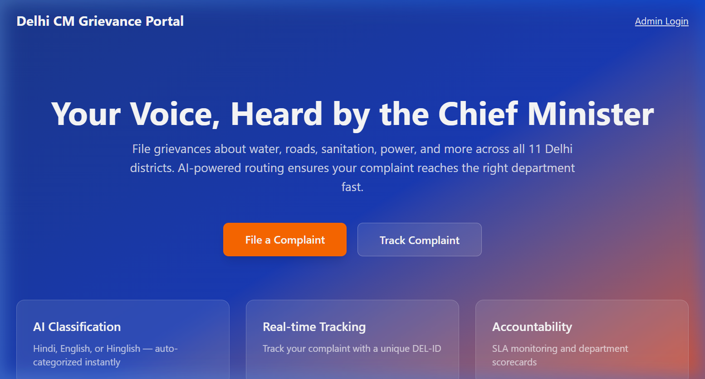
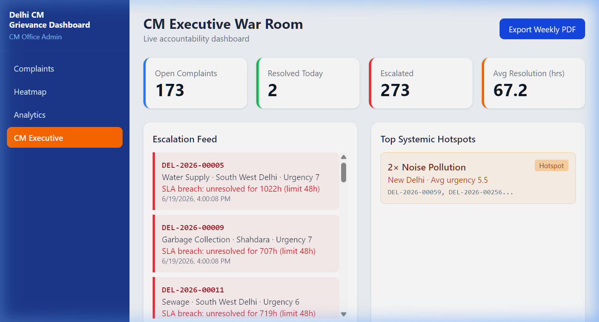
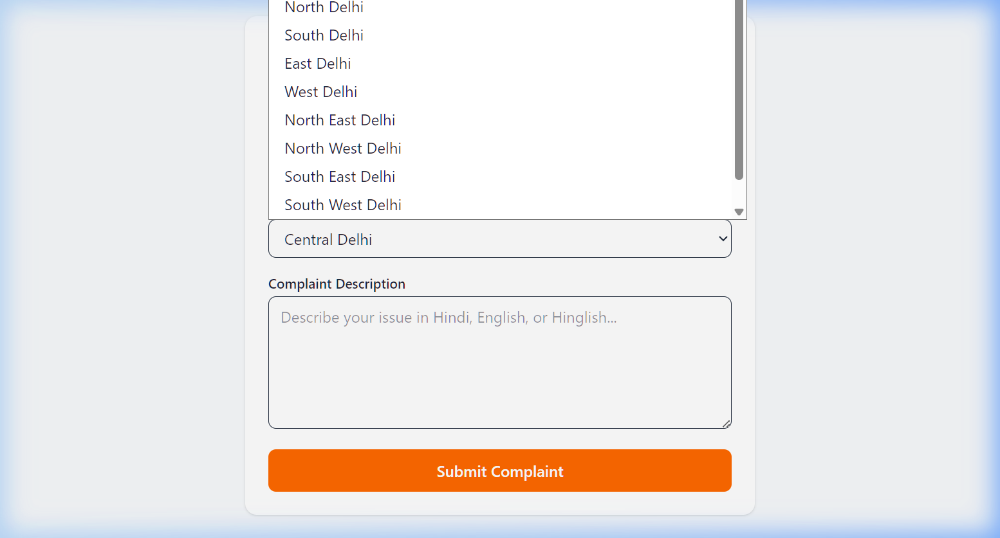
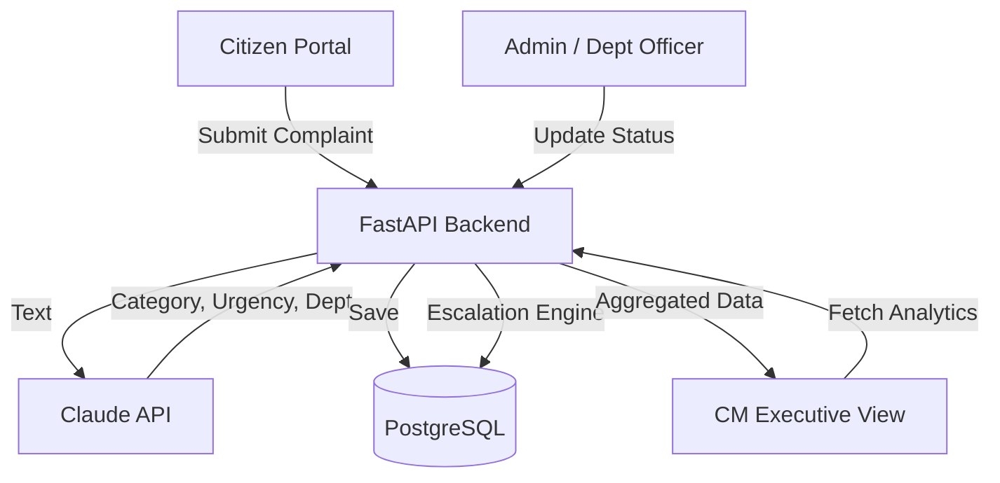

# Delhi CM Grievance & Complaint Management Dashboard

A 7-day sprint prototype for a comprehensive Chief Minister's Grievance tracking system. Built with modern web technologies, it features an AI-powered complaint classifier, geospatial analytics, and a multi-level role-based dashboard for Citizens, Department Officers, and the CM's Executive team.

## MVP Success Criteria
- **End-to-End Capabilities**: Intake, Tracking, Analytics, Transparency, and Reporting flows are fully functional.
- **AI Categorization**: Uses Claude API to automatically categorize and score the urgency of complaints written in Hindi/English/Hinglish.
- **Geospatial Heatmap**: Includes a Delhi district heatmap with spatial clustering for quick hotspot identification.
- **Citizen Portal**: Citizens can track complaint progress using a unique `DEL-YYYY-XXXXX` ID and confirm resolution via OTP.
- **CM War Room**: Executive dashboard features live KPIs, department scorecards, an escalation feed, and weekly PDF report generation.

## Previews

**Landing Page & Citizen Portal**


**CM Executive War Room Dashboard**


**Complaint Management System**

## Architecture



## Tech Stack
- **Frontend**: React, Tailwind CSS, Recharts, Leaflet.js
- **Backend**: FastAPI (Python 3.11), SQLAlchemy
- **Database**: PostgreSQL (or SQLite for local development)
- **AI Integration**: Anthropic Claude API (`claude-3-5-sonnet-latest`)
- **Authentication**: JWT (JSON Web Tokens) with Role-Based Access Control (RBAC)

## Setup and Installation

### Prerequisites
- Python 3.11+
- Node.js 20+
- Docker (optional, for PostgreSQL database)
- Claude API Key (Anthropic)

### 1. Database Setup
You can use the provided `docker-compose.yml` to spin up a local PostgreSQL instance:
```bash
docker-compose up -d
```

### 2. Backend Setup
Navigate to the `backend` directory, create a virtual environment, and install dependencies:
```bash
cd backend
python -m venv .venv

# Activate virtual environment
# Windows:
.venv\Scripts\activate
# macOS/Linux:
source .venv/bin/activate

pip install -r requirements.txt
```

Create a `.env` file in the `backend` directory (copy from `.env.example`) and fill in your keys:
```env
DATABASE_URL="postgresql://cm:cm@localhost:5432/cm_dashboard"
# Or for local SQLite: DATABASE_URL="sqlite:///./cm_dashboard.db"
CLAUDE_API_KEY="your_api_key_here"
JWT_SECRET="supersecret_change_in_production"
```

Start the backend server:
```bash
uvicorn app.main:app --reload
```

### 3. Frontend Setup
Navigate to the `frontend` directory and install dependencies:
```bash
cd frontend
npm install
```

Start the Vite development server:
```bash
npm run dev
```

## Deployment Notes
- **Frontend**: Can be easily deployed to Vercel. Run `npm run build` to generate static assets.
- **Backend**: Suitable for deployment on Railway, Render, or any standard VPS. Ensure you set the environment variables appropriately.

*Built for the 7-Day Sprint Roadmap ending June 22, 2026.*
